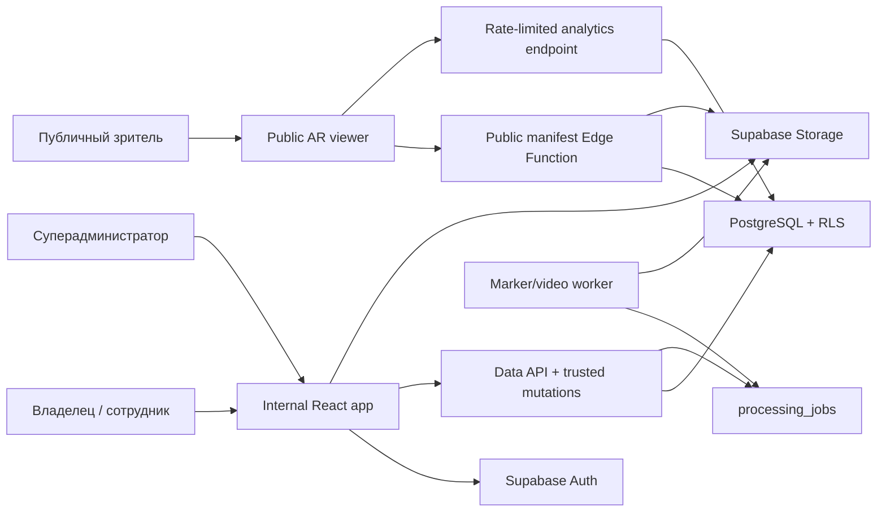
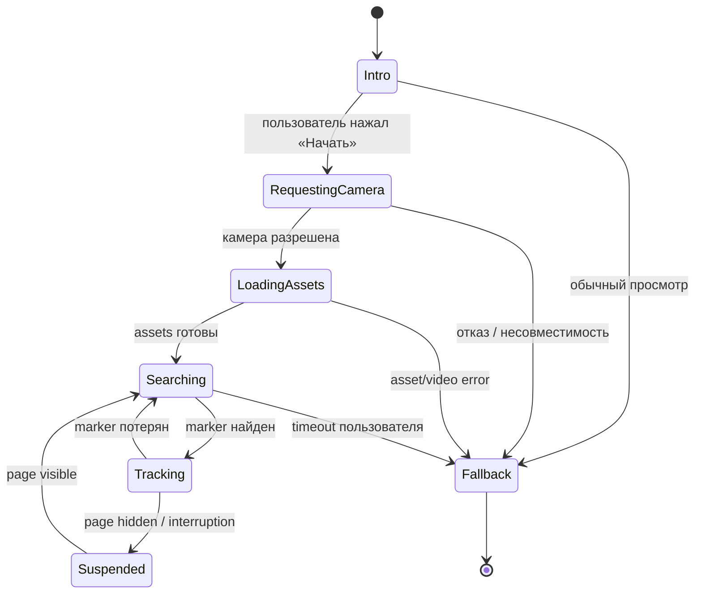
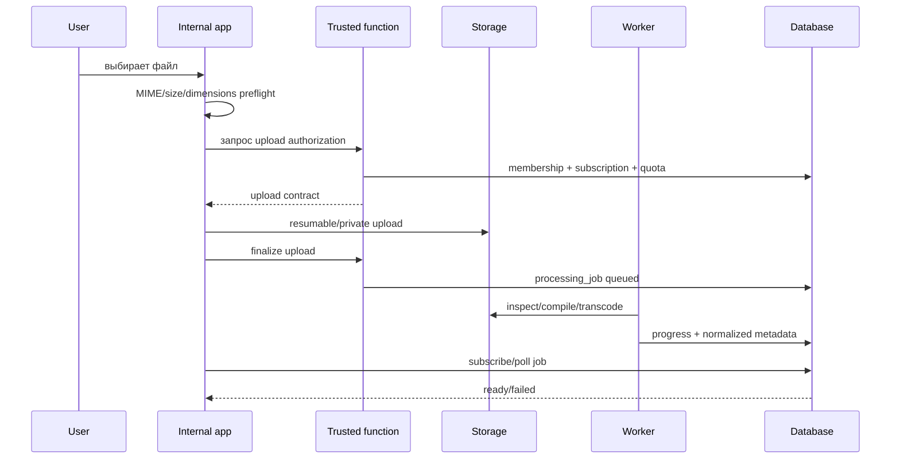

# AR Photo — целевая архитектура

## 1. Архитектурная цель

AR Photo должен состоять из двух изолированных frontend-поверхностей и доверенного backend:

1. Internal app — личный кабинет владельца, сотрудников и суперадминистратора.
2. Public AR viewer — минимальный mobile-first route без обязательной регистрации.
3. Backend — Supabase Auth, Postgres, Storage и небольшое число Edge Functions; тяжёлая обработка выносится в заменяемый worker.

Текущий IndexedDB-прототип не удаляется сразу. На этапах 1–3 он используется как fixture/demo adapter, пока production repositories подключаются по одному.

## 2. Контекст системы



## 3. Frontend boundaries

Предлагаемая структура:

```text
src/
  app/
    providers/
    router/
    styles/
  pages/
    auth/
    dashboard/
    projects/
    groups/
    ar-items/
    analytics/
    settings/
    admin/
    public-ar/
  features/
    auth/
    project-create/
    group-create/
    media-upload/
    ar-item-publish/
    qr-download/
  entities/
    account/
    project/
    group/
    ar-item/
    subscription/
  ar/
    contracts/
    mindar/
    viewer/
  shared/
    api/
    config/
    errors/
    lib/
    ui/
```

Правила зависимостей:

- `shared` не импортирует domain features;
- `entities` содержит schema/types и read models;
- `features` реализует use cases, но не routes;
- `pages` только композируют features;
- `ar/contracts` не зависит от MindAR;
- Supabase DTO не становятся UI-моделями без mapper;
- browser-only APIs изолируются и мокируются в tests.

## 4. Состояние и получение данных

- TanStack Query хранит server state, invalidation и безопасные retries для чтения.
- Zustand хранит только короткоживущий UI state: wizard, navigation drawer, upload queue.
- React Hook Form + Zod управляют формами и client-side UX validation.
- Supabase остается источником истины; IndexedDB может кэшировать read-only metadata и незавершённые upload drafts.
- Query keys всегда account-scoped.
- Unsafe mutations не повторяются автоматически.
- Blob URL создаются на время preview и освобождаются в cleanup.

## 5. Маршрутизация

### Public

- `/ar/:publicSlug`
- `/privacy`
- `/unsupported`

### Authenticated

- `/login`
- `/reset-password`
- `/update-password`
- `/dashboard`
- `/projects`
- `/projects/:projectId`
- `/projects/:projectId/groups/:groupId`
- `/items/new`
- `/items/:itemId/edit`
- `/items/:itemId/qr`
- `/analytics`
- `/settings/*`
- `/admin/*`

Public AR получает отдельный lazy bundle. Internal dashboard не должен загружать MindAR/Three.js. Текущий build подтверждает необходимость: AR chunks занимают большую часть bundle.

## 6. Backend boundaries

### Прямой Data API с RLS

Используется для безопасного чтения и не quota-sensitive edits. Доступ разрешён только к явно нужным таблицам и операциям. С 2026 года новые Supabase tables могут не публиковаться в Data API автоматически, поэтому GRANT является явной частью миграций, а не предположением.

### Edge Functions

Используются только там, где нужен доверенный boundary:

- создание аккаунта/пользователя суперадмином;
- quota-sensitive create/publish operations;
- выдача upload authorization;
- публичный AR manifest и signed media URLs;
- rate-limited analytics ingestion;
- административные операции;
- orchestration/retry processing jobs.

`service_role` существует только внутри защищённой server environment. Каждая function проверяет JWT, membership, account status и subscription status.

### Processing worker

Абстракции:

```ts
interface MarkerTrackingProvider {
  analyzeMarker(input: MarkerInput): Promise<MarkerAnalysis>;
  compileMarker(input: MarkerCompileInput): Promise<TrackingAsset>;
  testMarker(input: MarkerTestInput): Promise<MarkerTestResult>;
  deleteTrackingAsset(assetId: string): Promise<void>;
}

interface VideoProcessingProvider {
  inspect(input: VideoInput): Promise<VideoInspection>;
  transcode(input: VideoTranscodeInput): Promise<ProcessedVideo>;
  generateThumbnail(input: ThumbnailInput): Promise<Thumbnail>;
}
```

MindAR adapter — первая реализация `MarkerTrackingProvider`. Перед выбором worker runtime нужен spike: compile time, RAM, concurrency, cancellation и стоимость на реальных фото. Supabase Edge Functions не считаются подходящими для ffmpeg/тяжёлой compilation без измерений.

## 7. Public AR manifest

QR содержит только `https://<public-domain>/ar/<random-slug>`.

Viewer вызывает public manifest endpoint, который:

1. нормализует и rate-limits slug;
2. проверяет `published`, `deleted_at`, `expires_at`, account/subscription/grace rules;
3. создаёт короткоживущие signed URLs;
4. возвращает только title, behavior flags, dimensions, poster, tracking asset и optimized video;
5. не возвращает `account_id`, внутренний item UUID, email или постоянный Storage path.

Пример контракта:

```ts
type PublicArManifest = {
  title: string;
  posterUrl: string;
  trackingAssetUrl: string;
  videoUrl: string;
  markerAspectRatio: number;
  behavior: {
    autoplay: boolean;
    loop: boolean;
    markerLost: "pause_hide" | "continue_audio_hide" | "stop_reset";
    audioDefault: "muted" | "user_enabled";
  };
  fallbackEnabled: boolean;
  signedUrlsExpireAt: string;
};
```

## 8. AR viewer state machine



Viewer обязан:

- запрашивать камеру только после явного действия;
- сначала проверять HTTPS, mediaDevices, WebGL и orientation support;
- запускать звук только после user gesture;
- при `targetLost` применять сохранённую политику;
- освобождать camera tracks, renderer, textures и Object URLs;
- иметь обычный video fallback;
- отправлять аналитику асинхронно и без блокировки playback.

## 9. Upload pipeline



Файл не считается валидным по имени или browser MIME. До publication worker проверяет magic bytes, размер, декодирование, duration, dimensions и codec.

## 10. Deployment

Для коммерческой версии static GitHub Pages недостаточно. Минимальная схема:

- frontend hosting с HTTPS, SPA rewrites, CSP и security headers;
- отдельные preview/staging/production environments;
- отдельные Supabase projects для local/staging/production;
- migrations в Git и controlled deploy;
- custom domain для стабильных QR;
- secrets только в platform secret storage;
- Sentry/эквивалент — отдельное решение после согласования, без передачи media/PII.

PWA caching должен иметь allowlist: hashed application assets и явно разрешённые metadata. Signed media responses, auth endpoints и private API responses не кэшируются service worker по умолчанию.

## 11. Architecture decisions pending

- ADR-001: processing worker runtime;
- ADR-002: signed URLs против публичного optimized-media CDN;
- ADR-003: offline metadata и черновики;
- ADR-004: analytics retention/aggregation;
- ADR-005: hosting provider и custom domain;
- ADR-006: data residency и legal basis;
- ADR-007: миграция локальных ZIP-проектов.

## 12. Ссылки на актуальные Supabase правила

- [Row Level Security](https://supabase.com/docs/guides/database/postgres/row-level-security)
- [Storage access control](https://supabase.com/docs/guides/storage/security/access-control)
- [Password-based Auth](https://supabase.com/docs/guides/auth/passwords)
- [Supabase changelog](https://supabase.com/changelog)

