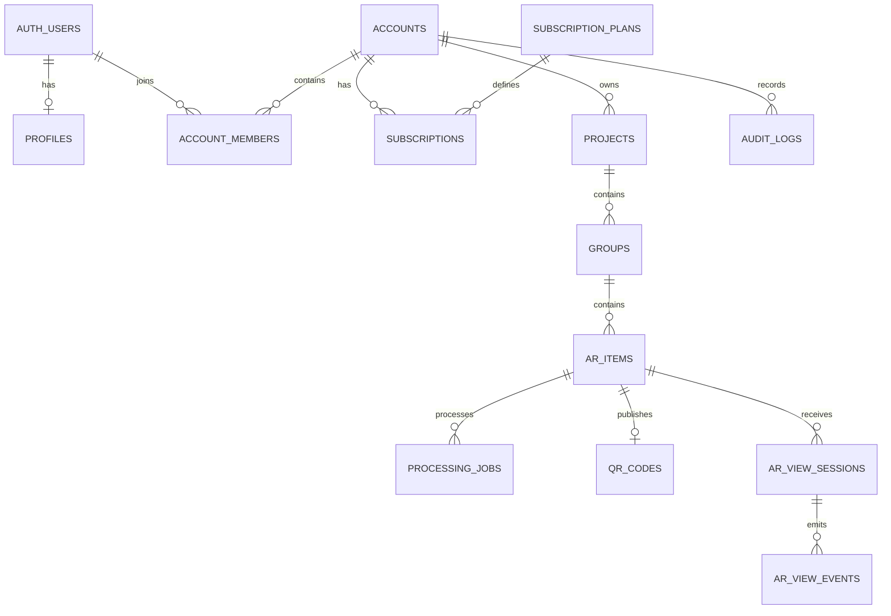

# AR Photo — модель данных

## 1. Область документа

Документ описывает применённую PostgreSQL/Supabase схему этапа 2. Источник истины — последовательные SQL-миграции в `supabase/migrations`; CI разворачивает их с нуля на PostgreSQL 17, выполняет seed, lint и pgTAP-тесты.

Все UUID генерируются сервером. Все timestamps — `timestamptz`. Денормализованный `account_id` используется на tenant-bound таблицах для простых и быстрых RLS policies, но всегда устанавливается/проверяется доверенной server logic.

## 2. Схемы

- `public`: только таблицы/read models, которые осознанно доступны Data API;
- `private`: authorization helpers, quota functions и internal processing routines; schema не публикуется в Data API;
- `storage`: управляется Supabase Storage;
- `auth`: управляется Supabase Auth.

Публичный AR viewer не получает `SELECT` к рабочим таблицам. Его contract формирует Edge Function.

## 3. Enums

Предлагаемые enums или эквивалентные check constraints:

- `account_status`: `active`, `suspended`, `closed`;
- `member_role`: `owner`, `manager`, `editor`, `viewer`;
- `profile_role`: `superadmin`, `account_user`;
- `subscription_status`: `trial`, `active`, `grace_period`, `expired`, `suspended`, `cancelled`;
- `project_status`: `draft`, `active`, `archived`;
- `project_category`: `graduation`, `wedding`, `family`, `birthday`, `travel`, `advertising`, `museum`, `other`;
- `ar_item_status`: `draft`, `processing`, `ready`, `published`, `failed`, `suspended`, `archived`;
- `tracking_status`: `uploaded`, `analyzing`, `unsuitable`, `compiling`, `ready`, `failed`;
- `visibility`: `private`, `public`;
- `marker_lost_behavior`: `pause_hide`, `continue_audio_hide`, `stop_reset`;
- `job_type`: `marker_analysis`, `marker_compilation`, `video_inspection`, `video_transcode`, `thumbnail_generation`, `qr_generation`, `storage_cleanup`;
- `job_status`: `queued`, `running`, `succeeded`, `failed`, `cancelled`;
- `ar_event_type`: `page_open`, `camera_started`, `marker_detected`, `playback_started`, `progress_25`, `progress_50`, `progress_75`, `completed`, `error`.

## 4. Основные таблицы

### `accounts`

| Column                     | Type                      | Notes                                                     |
| -------------------------- | ------------------------- | --------------------------------------------------------- |
| `id`                       | uuid PK                   | server-generated                                          |
| `name`                     | text                      | 1–120 chars                                               |
| `slug`                     | text unique               | internal human-readable slug, не public AR slug           |
| `owner_user_id`            | uuid FK → `auth.users.id` | bootstrap owner                                           |
| `logo_path`                | text nullable             | private Storage path                                      |
| `status`                   | account_status            | default `active`                                          |
| `timezone`                 | text                      | default `Europe/Moscow` only if product decision confirms |
| `created_at`, `updated_at` | timestamptz               | server timestamps                                         |

Indexes: unique normalized `slug`, `owner_user_id`, `status`.

### `profiles`

| Column                     | Type                         | Notes                                                    |
| -------------------------- | ---------------------------- | -------------------------------------------------------- |
| `id`                       | uuid PK/FK → `auth.users.id` | identity                                                 |
| `full_name`                | text                         | not used in Storage names                                |
| `email_display`            | text                         | display copy, Auth remains source of truth               |
| `avatar_path`              | text nullable                | private                                                  |
| `account_id`               | uuid nullable FK             | active/default account for MVP, not authorization source |
| `role`                     | profile_role                 | superadmin flag is server-controlled                     |
| `is_active`                | boolean                      | default true                                             |
| `last_login_at`            | timestamptz nullable         | server maintained                                        |
| `created_at`, `updated_at` | timestamptz                  | server timestamps                                        |

Authorization never trusts `user_metadata`; membership tables and server-controlled app metadata are authoritative.

### `account_members`

| Column                      | Type                      | Notes                    |
| --------------------------- | ------------------------- | ------------------------ |
| `id`                        | uuid PK                   |                          |
| `account_id`                | uuid FK                   | tenant                   |
| `user_id`                   | uuid FK → `auth.users.id` | member                   |
| `role`                      | member_role               | coarse role              |
| `permissions`               | jsonb                     | validated permission map |
| `is_active`                 | boolean                   | immediate access switch  |
| `invited_at`, `accepted_at` | timestamptz nullable      | lifecycle                |
| `created_at`, `updated_at`  | timestamptz               |                          |

Constraints: unique `(account_id, user_id)`. Index `(user_id, account_id)` and partial active-member index.

### `subscription_plans`

Fields: `id`, unique `code`, `name`, `description`, `storage_limit_bytes`, `project_limit`, `group_limit`, `ar_item_limit`, `video_duration_limit_seconds`, `max_video_size_bytes`, `team_limit`, `is_active`, `created_at`, `updated_at`.

All limits are non-negative. Plan rows are modified only by superadmin flow.

### `subscriptions`

Fields: `id`, `account_id`, `plan_id`, `status`, `starts_at`, `expires_at`, `grace_period_ends_at`, `custom_limits jsonb`, `is_active`, `created_at`, `updated_at`.

Constraints prevent inverted date ranges. There may be only one current subscription per account; history is retained. Effective limits are calculated by trusted SQL/service logic, not frontend merge.

### `projects`

Fields: `id`, `account_id`, `name`, `description`, `cover_path`, `category`, `event_date`, `status`, `note`, `created_by`, `created_at`, `updated_at`, `archived_at`, `deleted_at`.

Indexes: `(account_id, status, updated_at desc)`, `(account_id, deleted_at)`. Names are not globally unique.

### `groups`

Fields: `id`, `project_id`, `account_id`, `name`, `description`, `cover_path`, `sort_order`, `created_by`, `created_at`, `updated_at`, `archived_at`, `deleted_at`.

Constraint or trusted trigger verifies that `projects.account_id = groups.account_id`. Indexes: `(project_id, sort_order)`, `(account_id, updated_at desc)`.

### `ar_items`

Fields:

- identity: `id`, `account_id`, `project_id`, `group_id`;
- content: `title`, `description`, unpredictable unique `public_slug`;
- lifecycle: `status`, `visibility`, `published_at`, `expires_at`, `deleted_at`;
- marker: `marker_asset_id`, `marker_image_path`, `marker_preview_path`, `marker_width`, `marker_height`, `marker_quality_score`, `marker_quality_details jsonb`, override timestamp/actor/reason;
- video: `video_asset_id`, `video_path`, `video_thumbnail_path`, `video_duration_seconds`;
- tracking: `tracking_dataset_path`, `tracking_status`, revision в `version`;
- behavior: `autoplay`, `loop_video`, `marker_lost_behavior`, `audio_default`, `fallback_enabled`;
- audit: `created_by`, `created_at`, `updated_at`.

Constraints verify account/project/group consistency. `public_slug` uses at least 128 bits of CSPRNG entropy, is not derived from UUID/email/path, and never changes when media paths change.

Indexes: unique `public_slug`; `(account_id, status, updated_at desc)`; `(group_id, status)`; `(project_id, status)`; partial published index.

### `processing_jobs`

Fields: `id`, `account_id`, `ar_item_id`, `type`, `status`, `progress`, `attempt_count`, `max_attempts`, `dedupe_key`, `error_code`, `error_message`, `input_metadata`, `output_metadata`, `locked_at`, `locked_by`, `started_at`, `completed_at`, `created_at`, `updated_at`.

`progress` is 0–100. `dedupe_key` делает `(account_id, revision, job type)` уникальным, а claim использует `FOR UPDATE SKIP LOCKED`. `locked_at` одновременно служит heartbeat lease; stale jobs повторяются до `max_attempts`. Technical stack traces остаются в protected worker logs, а таблица получает только allowlisted code и безопасное сообщение.

### `qr_codes`

Fields: `id`, `account_id`, `ar_item_id` unique, `public_url`, `svg_path`, `png_path`, `style jsonb`, `version`, `created_at`, `updated_at`.

`public_url` is derived from configured public origin and `public_slug`; it never contains signed URLs or internal ids. `style` допускает только строгий preset contract, а `version` увеличивается при rotate/style change, чтобы скачанные QR assets имели детерминированные имена и не смешивались между ревизиями.

### `ar_view_sessions`

Fields: `id`, `ar_item_id`, `account_id`, `session_token_hash`, `started_at`, `ended_at`, `marker_detected_at`, `playback_started_at`, `completed`, `duration_watched_seconds`, `device_type`, `browser_family`, `os_family`, optional `country_code`, `referrer_domain`, `error_code`.

No raw IP, fingerprint or full user-agent is stored by default. Retention and country derivation require a legal/product decision.

### `ar_view_events`

Fields: `id`, `session_id`, `ar_item_id`, `account_id`, `event_type`, `occurred_at`, `value_numeric`, `error_code`, `metadata_safe jsonb`.

This table supports 25/50/75% metrics without overloading the session row. Ingestion validates an allowlist and limits events per session.

### `audit_logs`

Fields: `id`, `account_id`, `actor_user_id`, `action`, `entity_type`, `entity_id`, `metadata_safe jsonb`, `created_at`.

Append-only for application roles. Sensitive values, raw filenames and signed URLs are excluded.

## 5. Relationships



## 6. Quota and mutation rules

Frontend показывают usage, но не разрешают операцию.

Create project/group/AR item, add member, upload finalize и publish выполняются через trusted server boundary. Он:

1. получает user id из проверенного JWT;
2. проверяет active membership и permission;
3. блокирует/читает актуальную subscription row;
4. вычисляет effective limits;
5. считает только non-deleted resources;
6. записывает resource и audit log одной транзакцией;
7. не принимает `account_id` как доказательство полномочий.

Повторный request использует idempotency key, чтобы двойной клик не создавал дубликат.

## 7. RLS matrix

| Table                 | anon | authenticated member                 | owner/manager                    | superadmin            |
| --------------------- | ---- | ------------------------------------ | -------------------------------- | --------------------- |
| profiles              | нет  | свой профиль/разрешённые team fields | team read/manage via server flow | protected server flow |
| accounts              | нет  | свой active account read             | update allowed fields            | protected server flow |
| account_members       | нет  | own membership read                  | team read/manage by permission   | protected server flow |
| plans/subscriptions   | нет  | current effective read               | current/history read             | protected server flow |
| projects/groups/items | нет  | account-scoped by permission         | account-scoped CRUD              | protected server flow |
| processing_jobs       | нет  | account-scoped read                  | retry via server flow            | protected server flow |
| qr_codes              | нет  | account-scoped read                  | regenerate via server flow       | protected server flow |
| analytics             | нет  | permission-scoped aggregate read     | account-scoped read              | protected server flow |
| audit_logs            | нет  | обычно нет                           | filtered account read            | protected server flow |

Для UPDATE создаются SELECT policy, `USING` и `WITH CHECK`. Policies используют `TO authenticated` плюс membership predicate. Indexes покрывают columns, используемые RLS.

Views либо `security_invoker = true`, либо находятся в непубличной schema. `SECURITY DEFINER` допускается только в `private`, с фиксированным `search_path`, явной проверкой `auth.uid()` и отозванным `EXECUTE FROM PUBLIC`.

## 8. Storage model

Buckets:

- `markers-private`;
- `videos-private`;
- `tracking-private`;
- `avatars-private`;
- `project-covers-private`;
- `generated-public` — только QR/несекретные брендовые assets после отдельной проверки.

Path contract:

```text
accounts/{accountId}/projects/{projectId}/groups/{groupId}/items/{itemId}/marker/{assetId}/original
accounts/{accountId}/projects/{projectId}/groups/{groupId}/items/{itemId}/marker/{assetId}/preview.webp
accounts/{accountId}/projects/{projectId}/groups/{groupId}/items/{itemId}/video/{assetId}/original
accounts/{accountId}/projects/{projectId}/groups/{groupId}/items/{itemId}/video/{assetId}/optimized.mp4
accounts/{accountId}/projects/{projectId}/groups/{groupId}/items/{itemId}/tracking/{assetId}/target.mind
generated/qr/{itemId}/{version}.svg
```

До привязки upload к AR Item этап 4 использует reservation path:

```text
accounts/{accountId}/projects/{projectId}/groups/{groupId}/uploads/{sessionId}/v{version}/marker.jpg
accounts/{accountId}/projects/{projectId}/groups/{groupId}/uploads/{sessionId}/v{version}/video.mp4
```

`upload_sessions` резервирует quota и версию на 24 часа. `finalize_media_upload` под блокировкой сверяет private Storage object и создаёт `media_assets`; незавершённые sessions lease-ятся service-only cleanup worker и получают retryable acknowledgement.

Имена пользователя и ФИО не входят в paths. Replace создаёт новую immutable asset version. Upsert используется только с policies на INSERT + SELECT + UPDATE; предпочтительнее versioned write без upsert.

## 9. Public manifest boundary

`get_public_ar_manifest_source(public_slug)` — service-only `SECURITY DEFINER` RPC с пустым `search_path`. Он возвращает только allowlisted presentation/behavior fields и private bucket/path source для Edge signing, причём только для `published + public + ready` item без expiry/deletion, активного account и действующей trial/active/grace subscription. Внешние роли `public`, `anon` и `authenticated` не имеют `EXECUTE`.

`private.public_manifest_rate_limits` хранит только ключи вида `ip:<salted_sha256>` и `slug:<salted_sha256>`, начало окна и счётчик. `consume_public_manifest_rate_limit` обновляет bucket атомарным upsert; таблица полностью закрыта от browser roles. Edge Function применяет окна 60 секунд с бюджетами 60 запросов для network identifier и 240 для slug. Raw IP и raw slug в таблицу не попадают.

## 10. Publication boundary

Authenticated clients используют четыре audited RPC вместо прямой записи lifecycle-полей:

- `publish_ar_item(account, item, public_base_url, expires_at)` блокирует item, требует write permission и действующую subscription, перепроверяет private marker/video assets, generated tracking/poster и четыре `succeeded` job текущей revision, затем атомарно открывает item и upsert-ит один QR;
- `unpublish_ar_item(account, item)` доступен owner/manager/editor независимо от create quota/subscription, чтобы публикацию всегда можно было безопасно отозвать;
- `rotate_ar_item_public_slug(account, item, public_base_url)` меняет CSPRNG slug только у опубликованной работы, очищает ссылки на generated QR assets и увеличивает QR version;
- `update_ar_item_qr_style(account, item, style)` нормализует строгий allowlist `preset/foreground/background/quietZone/logo/logoScale` и увеличивает version.

Прямые browser grants на `ar_items.status`, `visibility`, `published_at`, `expires_at` и `public_slug` не являются publication API. Старый URL после rotate и manifest после unpublish закрываются теми же server-side predicates. Все QR mutations создают минимальный audit log без URL, slug, PII и Storage credentials.

## 11. Миграции и seed

Основа этапа 2 реализована reviewable миграциями, а этапы 3–4 добавляют только последующие migrations:

- foundation: extensions, enums, timestamps и 144-bit public slug;
- core schema: 13 таблиц, constraints, foreign keys и supporting indexes;
- security: explicit grants, forced RLS, membership/subscription helpers и audit triggers;
- trusted mutations: account bootstrap и idempotent quota-aware project/group/item creation;
- Storage: пять private buckets и явные object policies.
- catalog mutations: atomic group reorder/move и cover constraints;
- media uploads: reservation lifecycle, private versions, accounting, metadata limits и cleanup lease/ack;
- AR processing: idempotent draft, media attachment/revision, four-job DAG, worker lease/heartbeat, retry, marker override и immutable generated-asset accounting.
- public AR manifest: service-only filtered source и durable privacy-preserving rate buckets.
- publication/QR: trusted readiness gate, reversible unpublish, slug rotation, strict style normalization и audit coverage.

`supabase/seed.sql` содержит только синтетические данные: superadmin, два изолированных аккаунта, active/expired subscription и role fixtures. `supabase/tests` проверяет schema/grants и RLS/Storage matrix. Тип `Database` генерируется Supabase CLI из реально поднятой схемы и хранится в `src/shared/api/database.types.ts`.

Hosted advisors запускаются после привязки development Supabase project; их отсутствие не заменяется утверждением о проверке remote infrastructure.

Особое правило 2026 года: exposed Data API grants задаются явно; RLS и GRANT проверяются как две отдельные границы.
